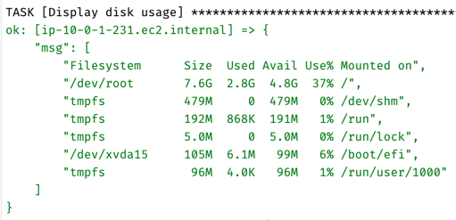

# AWS Bastion Setup

This guide provides step-by-step instructions to set up an AWS Bastion host using Packer and Terraform.
In this guide, please only change the values surrounded by **<...>** in the command line syntax.
Otherwise, please do NOT change the command line syntax—just copy, paste, and run.

## 1. Project outline
### 1.1. Custom AMI, using Packer
This program will create a custom AMI using Packer.
The custom AMI runs Amazon Linux as its OS and has Docker installed.
Additionally, the public key is baked into the AMI, allowing you to SSH into instances created by the custom AMI.

### 1.2. AWS Bastion
Using the custom AMI, a Bastion Host is launched in a public subnet, allowing access only from your IP address via port 22.
Additionally, six private EC2 instances are launched in a private subnet, with access restricted exclusively to the Bastion Host via port 22.

## 2. Preparation
### 2.1. Clone the project and navigate to the Directory
```sh
cd <project-directory>
```
Please change *<project-directory>* to your actual local project directory path.

### 2.2. Install Packer and Terraform (if needed)
Run the following commands to install the necessary tools:
```sh
brew tap hashicorp/tap  
brew install hashicorp/tap/packer  
brew install hashicorp/tap/terraform  
```

### 2.3. Generate an SSH Key Pair
Create an RSA key pair for secure access:
```sh
ssh-keygen -t rsa -b 4096 -f aws-key
```
Please do not enter passphrase. Just hit the `Enter` when prompted.
*Please do NOT change the name or location of the key pair.*
Packer and Terraform fetch the key pair using this specific name and location.

### 2.4. Load AWS Credentials and your IP address
```sh
export AWS_ACCESS_KEY_ID=<your-access-key-id>  
export AWS_SECRET_ACCESS_KEY=<your-secret-access-key>  
export AWS_SESSION_TOKEN=<your-session-token>
export TF_VAR_my_ip="$(curl -s https://checkip.amazonaws.com)/32"
```
Please replace the first three values (`<your-access-key-id>`, `<your-secret-access-key>`, `<your-session-token>`) with your actual AWS credentials.
The fourth line retrieves your IP address in CIDR format, which is then loaded into `variables.tf`.

## 3. Build the AWS AMI with Packer
Run the following command to create a custom AMI:
```sh
packer build packer-ami.pkr.hcl
```
Packer will fetch the public key located in the root of the project directory.

After the execution, you should have this output in the command line:


The created AMI's ID will be AUTOMATICALLY loaded by the Terraform data source by the AMI's tag.

## 4. Deploy the infrastructure using Terraform
Run the following command:
```sh
terraform init
terraform plan
terraform apply
```

After the execution, you'll see the outputs listing the **public IP address** of the Bastion Host and **private IP addresses** of the Private EC2 Instances:


If not, run this command:
```sh
terraform output
```
#### Now all the resources are ready!

## 5. SSH into the resources using the private key
### 5.1. SSH into the Bastion Host.
#### Load the private key into the SSH Agent:
```sh
ssh-add aws-key
```
SSH Agent acts as a key manager that keeps your private key in memory and provides it when needed.

#### Run the following command to SSH into the Bastion Host:
```sh
ssh -A -i aws-key ec2-user@<your_bastion_public_ip>
```
Please change *<your_bastion_public_ip>* with the actual IP address listed by above output.
The private key should be located at the root of the project directory with the name above.
You need to forward the SSH Agent to the Bastion for the further access to the private EC2 instances.

#### Once connected to the Bastion Host, you can verify that Docker is installed by running:
```sh
docker help
```

### 5.2. SSH into the private EC2 from the Bastion.
#### Run the following command to SSH into the private EC2 from the Bastion.
```sh
ssh ec2-user@<your_private_instance_ip>
```
Replace *<your_private_instance_ip>* with one of the actual IP addresses from the Terraform output.
SSH Agent will handle authentication without needing the private key on the bastion.

#### Once connected, vtererify that Docker is installed by running:
```sh
docker help
```

## 6. Check the resources
### 6.1. The custom AMI
##### The custom AMI displayed in AWS Console.


#### The OS is verified as Amazon Linus by checking the OS of an EC2 instance created from the custom AMI.



#### We need this tag of the AMI to load the AMI ID to terraform data source.


### 6.2. The VPC
#### The public subnets are exposed to the Internet Gateway.


#### The private subnets have a route to the NAT Gateway.


### 6.3. The Bastion Host and its security group
#### The Bastion Host is assigned to the public subnet, so it has a public IP address (EIP).


#### The security group allows inbound access only from your IP address via port 22.


#### You can SSH into the Bastion only from your machine using SSH Agent forwarding.


#### Docker is also installed.


### 6.4. The private EC2 instances and their security group
#### Six private EC2 instances are launched.


#### The private EC2 instances are located in the private subnet, meaning they do not have public IP addresses.


#### Their security group only allows access from the Bastion Host via port 22.


#### You can SSH into the private EC2 instance without worrying about the private key.


#### Docker is also installed.


## 7. Destroy the resources
#### Run the following command:
```sh
terraform destroy
```

#### This command won't destroy the custom AMI

## 8. Reflection
### 8.1. How to pass the AMI ID to terraform?
I understood `packer build` will return the AMI ID, but I wondered how to pass the ID to the workflow of terraform.
At first, I tried passing it through `tee build.log`. However, this required additional steps for the user and involved using `grep` with regex to parse the AMI ID from the `build.log`, which is error-prone.
I found this [article](https://stackoverflow.com/questions/47721602/how-are-data-sources-used-in-terraform), which suggested using data source. By using data source, the user does not need to manually pass the variable to another workflow, making the process easier and more reliable.

### 8.2. How to access to the private EC2 without copying the private key?
The private EC2 instance only allows access from the Bastion Host. To SSH into the private EC2, the private key would need to be present on the Bastion. This would require secure copy the private key to the Bastion, which is clearly not the best approach.
I found this [article](https://medium.com/devops-dudes/setting-up-an-ssh-agent-to-access-the-bastion-in-vpc-532918577949). With SSH Agent, there is no need to transfer the private key, which enhances security.

---

**Author:** *Koichi Nakata*
