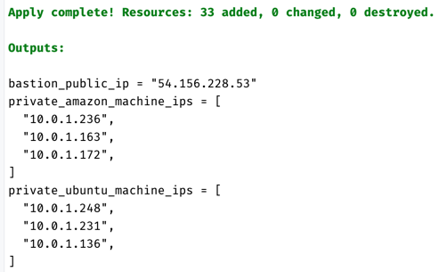

# IaC and Configuration Management Project

## 1. Setting up configuration
### 1.1. Generate SSH key pair
Navigate to the root of the project directory and generate a key pair:
```sh
ssh-keygen -t rsa -b 4096 -f ansible-key
```
The key pair needs to located at the root of the project directory and have the exact name above. Please don't change the location or name of the key pair.

### 1.2. Feed AWS credentials
Set up your AWS credentials in the environment:
```sh
export AWS_ACCESS_KEY_ID=<your-access-key-id>
export AWS_SECRET_ACCESS_KEY=<your-secret-access-key>
export AWS_SESSION_TOKEN=<your-session-token>
```

## 2. Build AMIs with packer
Change to the `packer` directory:
```sh
cd packer
```
Run the Packer build command:
```sh
packer build ami-builder.pkr.hcl
```
This Packer script will build 2 AMIs: one has the Ubuntu OS and Docker installed and the other one has the Amazon Linux OS and Docker installed.

## 3. Deploy infrastructure with terraform
Navigate to the `terraform` directory:
```sh
cd ../terraform
```
Feed your IP address to terraform variables:
```sh
export TF_VAR_my_ip="$(curl -s https://checkip.amazonaws.com)/32"
```
Deploy terraform configuration:
```sh
terraform init
terraform plan
terraform apply
```
You'll get the output like below. You'll need the `bastion_public_ip` later.



If needed, you can get the output again by:
```sh
terraform output
```

## 4. Run ansible playbook
Navigate to the `ansible` directory:
```sh
cd ../ansible
```
Feed the public IP of the bastion host:
```sh
export BASTION_IP=<public-ip-of-bastion-host>
```
Please replace `<public-ip-of-bastion-host>` with the actual IP address that you got from the terraform output.

Add the SSH key to the agent:
```sh
ssh-add ../ansible-key
```
Run the ansible playbook:
```sh
ansible-playbook -i inventory/aws_ec2.yml playbook.yml
```
`playbook.yml` will do the following 3 tasks:
- Update and upgrade the packages (if needed). The expected output is:

  

- Verify we are running the latest docker. The output below shows the version of Docker:
  
  

- Report the disk usage for each ec2 instance. The expecte output is:
  
  


## 5. Reflection
### 5.1. How to build multiple AMIs concurrently?
Building an AMI takes several minutes. If you need to build multiple AMIs, the process must run concurrently; otherwise, it could take hours.
If I create separate Packer scripts for each AMI, the workflow will build them sequentially, leading to inefficiencies. Instead, we can use multiple-source builds:


By defining all AMIs in a single file, we ensure they are built concurrently. However, this introduces a new challenge: each AMI requires different software installations. How do we separate the build instructions for each AMI?
The solution is to use the `only` clause. In the example below, the build command applies exclusively to the source `amazon_docker`:


Initially, I made a syntax mistake in this command and spent hours troubleshooting it. This experience reinforced an important lesson: always refer to the [official documentation](https://developer.hashicorp.com/packer/tutorials/aws-get-started/aws-get-started-parallel-builds) when encountering issues.
  
### 5.2. Writing a dynamic inventory was hard
To test whether my playbook worked, I first used a static inventory file (`ansible/inventory.ini`), where all IPs were hardcoded. This test confirmed that my proxy settings were correct.
Next, I rewrote the static inventory to a dynamic inventory file. Filtering and grouping EC2 instances worked well, but SSH-ing into the private machines failed. I ran the dynamic inventory and playbook from the bastion host, but I could only SSH into the Ubuntu machines. Since the bastion itself was an Ubuntu machine, I suspected that the `ansible_user` field was not functioning correctly.
I found this [StackOverflow post](https://stackoverflow.com/questions/70870752/how-to-set-usernames-in-ansible-dynamic-inventory-ec2), which described the exact issue I faced. Following the solution in the post, I created a `group_vars` directory and defined `ansible_user` for each OS in its respective yml file. This resolved the issue.
This challenge was particularly difficult because Ansible doesn't have useful documentation on writing dynamic inventory files. However, by browsing StackOverFlow and testing, I was able to find a solution.